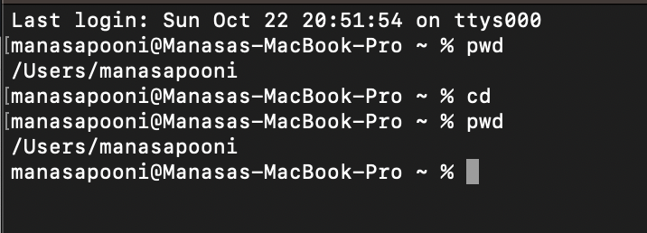
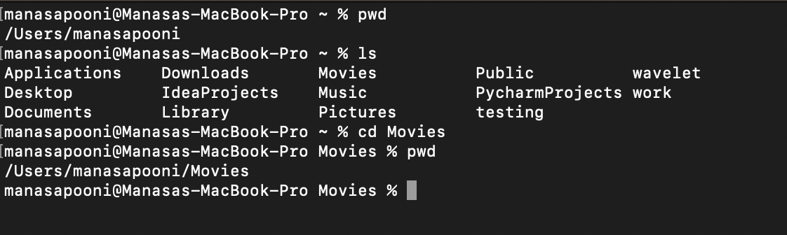
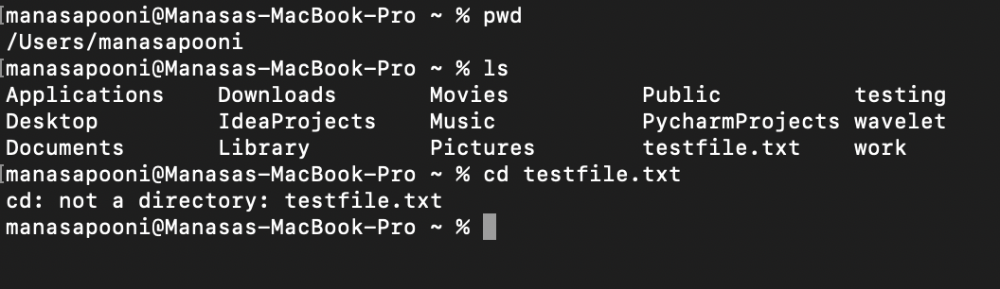
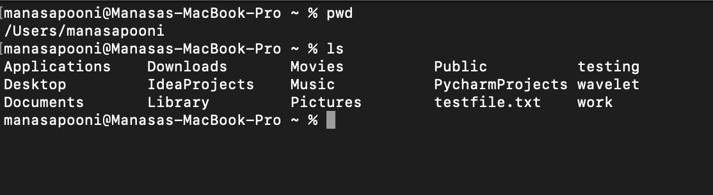
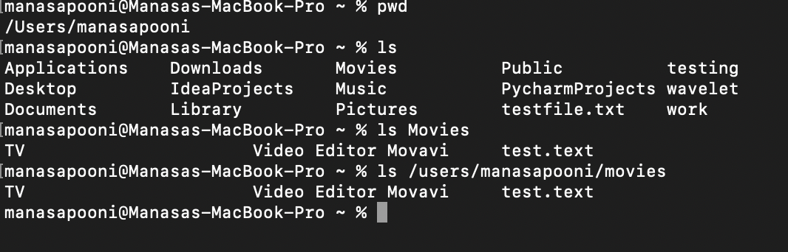
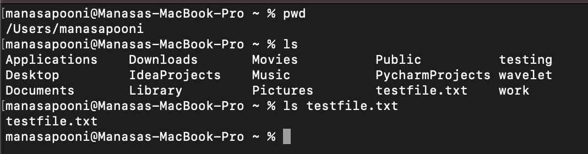
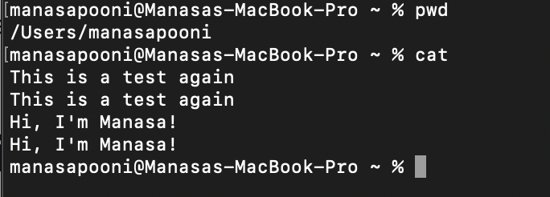
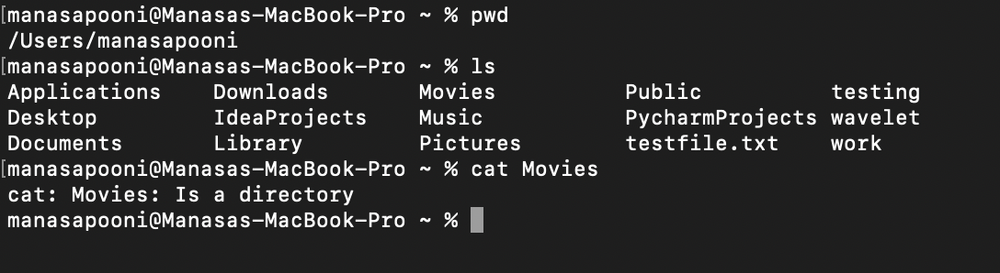
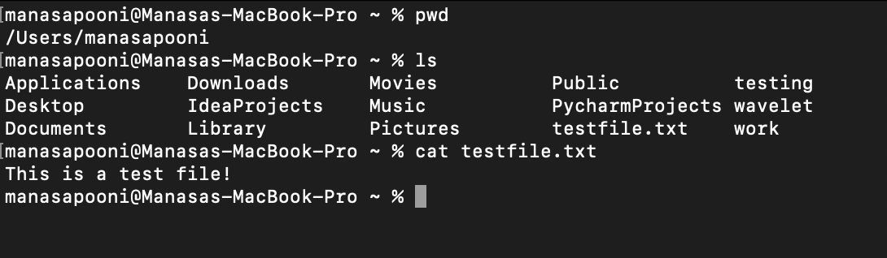

# Week 3 - Servers and SSH Keys

# **1. An example of using the cd command with no arguments**

```
import java.io.IOException;
import java.net.URI;
import java.util.ArrayList;

class Handler2 implements URLHandler {
    // The one bit of state on the server: a number that will be manipulated by
    // various requests.
    ArrayList<String> s = new ArrayList<String>();

    public String handleRequest(URI url) {
        if (url.getPath().equals("/")) {
            return String.format("Hello Manasa");
        } else if (url.getPath().contains("/add-message")) {
            String[] parameters = url.getQuery().split("=");
            if (parameters[0].equals("s")) {
                s.add(parameters[1]);
                StringBuffer sb = new StringBuffer();
                for (int index=0; index < s.size(); index++) {
                    sb.append((index+1) + ". " + s.get(index) + "\n");
                }
                return String.format(sb.toString());
            }
        } else if (url.getPath().contains("/search")) {
            String[] parameters = url.getQuery().split("=");
            if (parameters[0].equals("s")) {
                return find((String) parameters[1]);
            }
        }
        return "404 Not Found!";
    }
    
    public String find(String searchString) {
        ArrayList<String> temp = new ArrayList<String>();
        for (int index=0; index < s.size(); index++){
            if (s.get(index).indexOf(searchString) > 0){
                temp.add(s.get(index));
            }
        }
        return String.format(temp.toString());
    }
}

class SearchEngine {
    public static void main(String[] args) throws IOException {
        if(args.length == 0){
            System.out.println("Missing port number! Try any number between 1024 to 49151");
            return;
        }

        int port = Integer.parseInt(args[0]);

        Server.start(port, new Handler2());
    }
}

```



When we cd without an argument we stay in the same directory. The working directory is /users/manasapooni when the command was run. When you run the cd command without arguments the working directory would change to the home directory of the user. The ouput is not an error.

# **2. An example of using the cd command with a path to the directory as an argument**



When we cd using a path to a directory as an argument we get into that directory. The current working directory is /users/manasapooni. We do a cd to the Movies directory, the current working directory becomes /users/manasapooni/Movies. The output is not an error.

# **3. An example of using the cd command with a path to a file as an argument**



When we cd with a path to a file as an argument it doesn't work since cd changes only to directories and not to files and hence, we get an error saying "Not a directory". The current working directory is /users/manasapooni. When you run the cd command with  path to a file as argument as in this case testfile.txt you will get an error. The current working directory remains the same as /Users/manasapooni. The error would say the argument provided to cd is not a directory.

# **4. An example of using the ls command with no arguments**



When we ls without an argument, it lists the set of folders in the current directory. The working directory is /users/manasapooni when the command was run. When you run the ls command without arguments it lists the contents of the current working directory. The ouput is not an error.

# **5. An example of using the ls command with a path to the directory as an argument**



When we ls with a path to a directory as an argument, it prints the list of folders in the directory which we pass as an argument. The current working directory is /users/manasapooni. We do a ls of the Movies directory. It list the contents of the Movies directory including the files and directories.The output is not an error.

# **6. An example of using the ls command with a path to a file as an argument**



When we ls with a path to a file as an argument it just prints the name of the file as the output. The current working directory is /users/manasapooni. When you run the ls command with path to a file as argument as in this case testfile.txt it will list the file name. The output is not an error.

# **7. An example of using the cat command with no arguments**



The working directory is /users/manasapooni when the command was run. When you run the cat command without arguments it will echo whatever you type on the standard output.You have to exit by pressing control-d on the terminal. The output is not an error and the echo of the contents typed on the standard input on the standard output is an expected behavior. 

# **8. An example of using the cat command with a path to the directory as an argument**



When we cat with a path to a directory as an argument, it throws an error. Since cat only prints contents of files and not contents of a directory. It throws an error saying "Is a directory". The current working directory is /users/manasapooni. We do a cat of the Movies directory it results in the error. The cat command will complain it is a directory. The output is not an error.

# **9. An example of using the cat command with a path to a file as an argument**



When we cat with a path to a file as an argument, it prints the contents of the file which was passed as the argument. The current working directory is /users/manasapooni. When you run the cat command with path to a file as argument as in this case testfile.txt it will list the contents of the file. The output is not an error.
