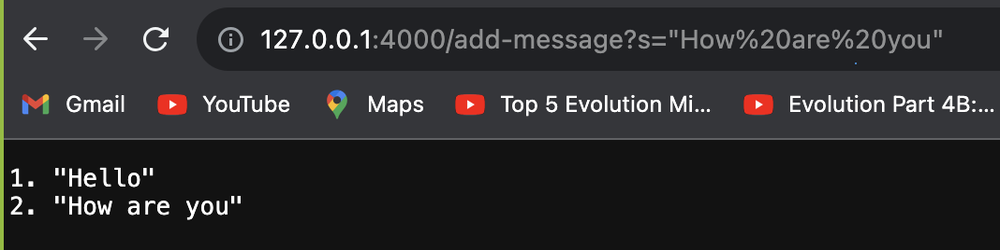

# Week 3 - Servers and SSH Keys

# **1. Code for StringServer.java**

```
import java.io.IOException;
import java.net.URI;
import java.util.ArrayList;

class Handler2 implements URLHandler {
    // The one bit of state on the server: a number that will be manipulated by
    // various requests.
    ArrayList<String> s = new ArrayList<String>();

    public String handleRequest(URI url) {
        if (url.getPath().equals("/")) {
            return String.format("Hello Manasa");
        } else if (url.getPath().contains("/add-message")) {
            String[] parameters = url.getQuery().split("=");
            if (parameters[0].equals("s")) {
                s.add(parameters[1]);
                StringBuffer sb = new StringBuffer();
                for (int index=0; index < s.size(); index++) {
                    sb.append((index+1) + ". " + s.get(index) + "\n");
                }
                return String.format(sb.toString());
            }
        } else if (url.getPath().contains("/search")) {
            String[] parameters = url.getQuery().split("=");
            if (parameters[0].equals("s")) {
                return find((String) parameters[1]);
            }
        }
        return "404 Not Found!";
    }
    
    public String find(String searchString) {
        ArrayList<String> temp = new ArrayList<String>();
        for (int index=0; index < s.size(); index++){
            if (s.get(index).indexOf(searchString) > 0){
                temp.add(s.get(index));
            }
        }
        return String.format(temp.toString());
    }
}

class SearchEngine {
    public static void main(String[] args) throws IOException {
        if(args.length == 0){
            System.out.println("Missing port number! Try any number between 1024 to 49151");
            return;
        }

        int port = Integer.parseInt(args[0]);

        Server.start(port, new Handler2());
    }
}

```

# **2. Two screen shots of /add-message**




# **3. Answer to questions**

1. Which methods in your code are called?

The search engine invokes main() which inturn invokes server.start(0 which start the serer at the required port. The server is waiting for incomming messages. Wehn we click
[](http://127.0.0.1:4000/add-message?s=) then it invokes handlerequest() method of the Handler2 class. This method checks if the URL path contains "/add-message". it then parses the given querystring to extract the contents of the string. It then adds the given string to the arraylist. while return it constructs a stringbuffer containing the index and the appropriates stringvalues from the array list. It then returns this output as the return value.

2. What are the relevant arguments to those methods, and the values of any relevant fields of the class?
   The handlerequest methiod is provided the path string as a parameter
   
3. How do the values of any relevant fields of the class change from this specific request? If no values got changed, explain why.


