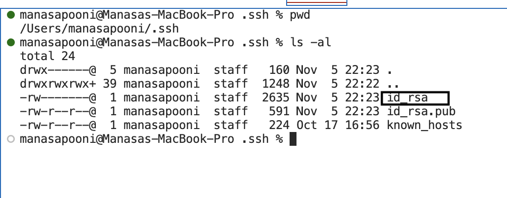

# Week 3 - Servers and SSH Keys

# PART 1

# **1. Code for StringServer.java**

```
import java.io.IOException;
import java.net.URI;
import java.util.ArrayList;

class Handler2 implements URLHandler {
    // The one bit of state on the server: a number that will be manipulated by
    // various requests.
    //
    String s = "";
    int index = 1;

    public String handleRequest(URI url) {
        if (url.getPath().equals("/")) {
            return String.format(s);
        } else if (url.getPath().contains("/add-message")) {
            String[] parameters = url.getQuery().split("=");
            if (parameters[0].equals("s")) {
                    s += " " + index  + ". " + parameters[1] + "\n";
                    index++;
                }
                return String.format(s);
            }
        return "404 Not Found!";
    }
}

class SearchEngine {
    public static void main(String[] args) throws IOException {
        if(args.length == 0){
            System.out.println("Missing port number! Try any number between 1024 to 49151");
            return;
        }

        int port = Integer.parseInt(args[0]);

        Server.start(port, new Handler2());
    }
}

```

# **2. Two screen shots of /add-message**


**1. Which methods in your code are called?**
   
When the SearchEngine class is invoked from the command line with the command line argument "4000" it invokes the main() method in SearchEngine which inturn invokes the method server.start() providing the port and an instance of the handler (handler2) which will start the server at the required port. The server is listening for incoming messages at the specified port (4000). When we click http://localhost:4000/add-message?s=Hello in the browser, on receiving this message the webserver calls the handlerequest() method of the Handler2 class passing in the provided URI /add-message?s=Hello. This method checks if the URL path contains "/add-message". If such is the case, it then then extracts the given querystring and parses the querystring to extract the key and the value. It checks to see if the key is equal to "s" then it appends to a String s which is a declared as a property at the instance level, a string produced by concatenating the current index followed by a ". ", the string value passed, followed by a new line. It then returns the String s as the return value (responds with the entire string so far).

```
   1. handleRequest(URI url)
   2. url.getPath() 
   3. url.getQuery()
   4. String[] parameters = url.getQuery.split("=")  <-- call split on the query string to split it into key and value based on "=" 
   5. s += " " + index  + ". " + parameters[1] + "\n";   
   6. String.Format(s)
```

**2. What are the relevant arguments to those methods, and the values of any relevant fields of the class?**
   
The handlerequest method is provided the URI string as a parameter url /add-message?s=Hello. We extract the path from the passed in parameter url by calling the helper method getPath() method on the url -> url.gethPath(). The getPath() method does not take any parameters. If the path contains "/add-messages" we then call the getQuery() helper method on the url to get the query string. The method getQuery() does not take any parameter. We call the split method on the query string based on regex "=". split takes the regex "=" as parameter and splits the string into two parts. If the key matches "s" then it appends to a String s which is a declared as a property at the instance level, a string produced by concatenating the current index followed by a ". ", the string value passed, followed by a new line. It then returns the String s as the return value (responds with the entire string so far).

```
url <- /add-message?s=Hello
url.getpath() <- /add-message
url.getQuery() <- s=Hello
String[] parameters = url.getQuery().split("=") <- parameters[0] = "s"; parameters[1] = "Hello"
String s = "1. Hello\n"
String.Format(s)
```

**3. How do the values of any relevant fields of the class change from this specific request? If no values got changed, explain why.**

For each specific request, if it is a add-message request the passed in string is appended to the String s. Also the index is incremented to point to the next string to be appended.
When the path is just "\", the contents of the String s is returned, none of the values get affected.


**1. Which methods in your code are called?**
   
When we click http://localhost:4000/add-message?s="How%20are%20you" in the browser, on receiving this message the webserver calls the handlerequest() method of the Handler2 class passing in the provided URI /add-message?s=How%20are%20you. This method checks if the URL path contains "/add-message". If such is the case , it then then extracts the given querystring and parses the querystring to extract the key and the value. It checks to see if the key is equal to "s" then it appends to a String s which is a declared as a property at the instance level, a string produced by concatenating the current index followed by a ". ", the string value passed, followed by a new line. It then returns the String s as the return value (responds with the entire string so far).

```
   1. handleRequest(URI url)
   2. url.getPath() 
   3. url.getQuery()
   4. String[] parameters = url.getQuery.split("=")  <-- call split on the query string to split it into key and value based on "=" 
   5. s += " " + index  + ". " + parameters[1] + "\n";   
   6. String.Format(s)
```

**2. What are the relevant arguments to those methods, and the values of any relevant fields of the class?**
   
The handlerequest method is provided the URI string as a parameter url /add-message?s=How are you. We extract the path from the passed in parameter url by calling the helper method getPath() method on the url -> url.gethPath(). The getPath() method does not take any parameters. If the path contains "/add-messages" we then call the getQuery() helper method on the url to get the query string. The method getQuery() does not take any parameter. We call the split method on the query string based on regex "=". split takes the regex "=" as parameter and splits the string into two parts. If the key matches "s" it then then extracts the given querystring and parses the querystring to extract the key and the value. It checks to see if the key is equal to "s" then it appends to a String s which is a declared as a property at the instance level, a string produced by concatenating the current index followed by a ". ", the string value passed, followed by a new line. It then returns the String s as the return value (responds with the entire string so far). 
```
url <- /add-message?s=How%20are%20you
url.getpath() <- /add-message
url.getQuery() <- s="How are you"
String[] parameters = url.getQuery().split("=") <- parameters[0] = "s"; parameters[1] = "How are you"
s = "1. Hello\n2. How are you\n"
String.Format(s)
```

**3. How do the values of any relevant fields of the class change from this specific request? If no values got changed, explain why.**

For each specific request, if it is a add-message request the passed in String s declared as a property at the class instanxce level. The index also gets incremented to pointed to next string to be appended. 

Initially String s = "1. Hello\n". Then the string s = "1. Hello\n2. How are you\n" on the second invocation.
The index is initally 1. Then it get incremented to 2 on the first call. It then gets incremented to 3 on the second call pointing to the next string the next string to be appended.

When the path is just "\", the contents of the String s is returned, none of the values get affected.

# PART 2

# **1. Private Key**


# **2. Public Key**


# **3. Terminal Interaction**


# PART 3

In this lab, I learned how to generate private and public keys using ssh-keygen. I also learned how to log into ieng6 without being asked for a password. Furthermore, I learnt how a web server processes incoming requests and how to write code to respond to such requests. 
