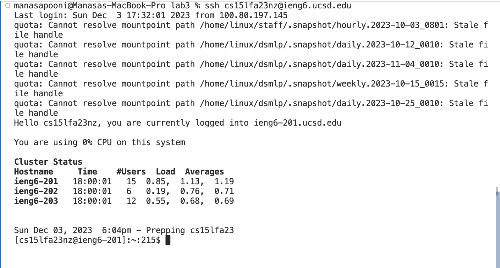
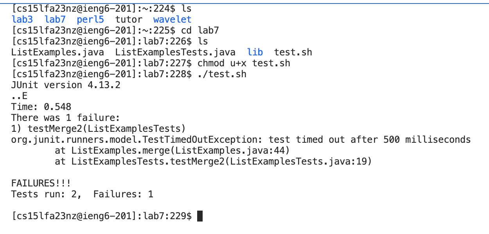

# Week 7 - Vim 

For this lab report we reproduce steps 4-9 shown below, take a screenshot, and write down exactly which keys were pressed to get to that step. 

Step 4. Log into ieng6

Step 5. Clone your fork of the repository from your Github account (using the SSH URL)

step 6.  Run the tests, demonstrating that they fail

step 7.  Edit the code file to fix the failing test

step 8. Run the tests, demonstrating that they now succeed

step 9.Commit and push the resulting change to your Github account (you can pick any commit message!)

# **4. Log into ieng6**



**Keys Pressed**: ```ssh cs15lfa23nz@ieng6.ucsd.edu``` was the command typed in at the command prompt followed by pressing the ```<enter>``` key to log in to the ieng6 account/computer. 

# **5. Clone your fork of the repository from your Github account (using the SSH URL)**


**Keys Pressed**: To complete this step, what I did was type in (on my keyboard)  ```git clone git@github.com:mpooni23/lab7.git```. Then I pressed the ```<enter>``` key to run the command, and the resulting screenshot demonstrates the cloning of the forked repository.

# **6. Run the tests, demonstrating that they fail**



**Keys Pressed**: To complete this step, what I did was to type ```ls``` followed by pressing the ```<enter>``` key to get the contents of the current directory. Then I typed ```cd lab7``` followed by ```<enter>```  get into the lab7 directory. This was followed by typing ```ls``` followed by pressing the ```<enter>``` key to get the contents of the lab7 directory. Then I typed ```chmod u+x tests.sh``` followed by ```<enter>```to add the execute permissions for the  current user on the test.sh shell script file. Then I ran the test.sh file by typing ```./test.sh``` followed by the ```<enter>``` command. This resulted in failure of one of the tests as shown in the resulting screenshot.

# **7. Edit the code file to fix the failing test**


# **8 Run the tests, demonstrating that they now succeed**


# **9 Commit and push the resulting change to your Github account (you can pick any commit message!)**


