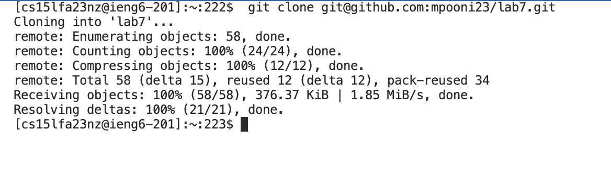
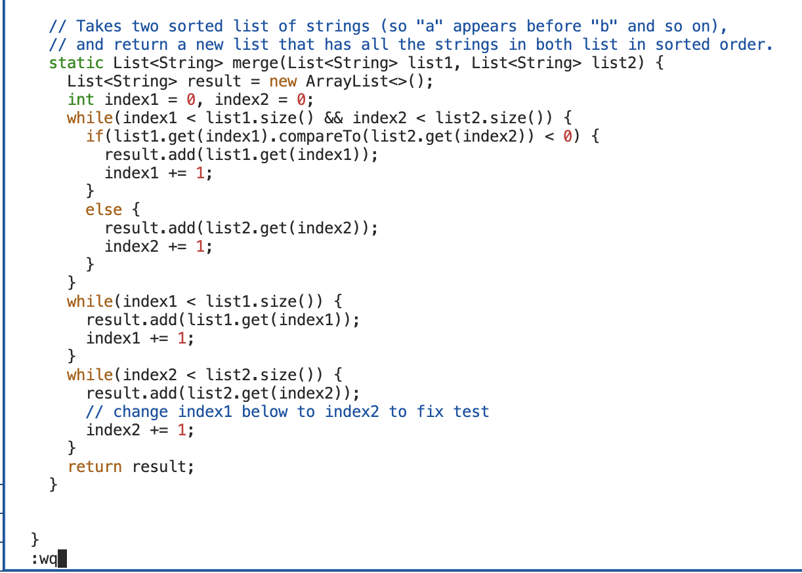
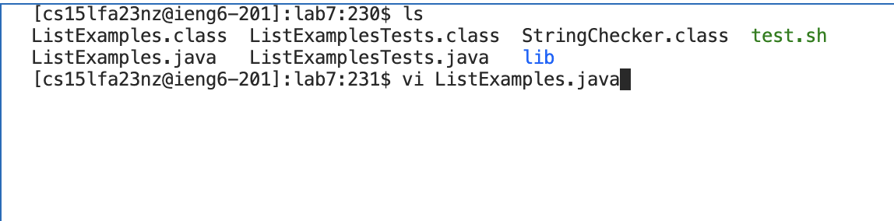
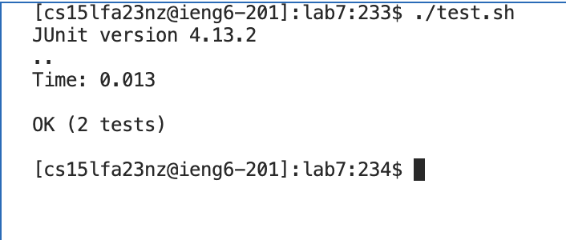
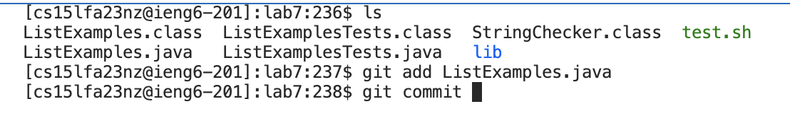
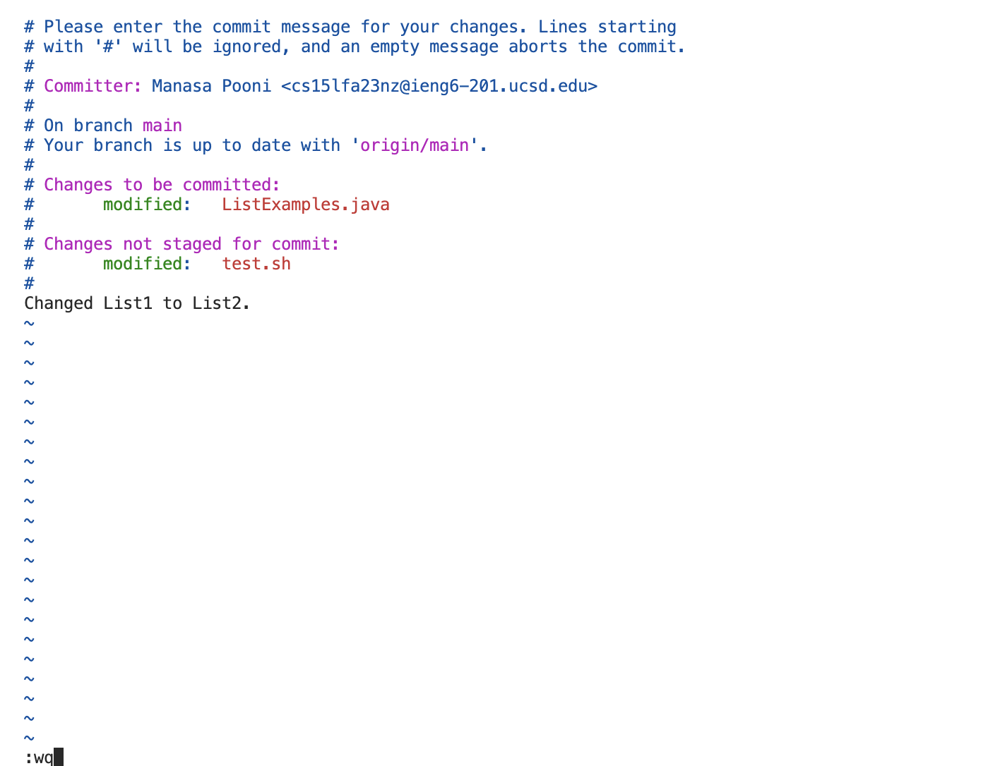
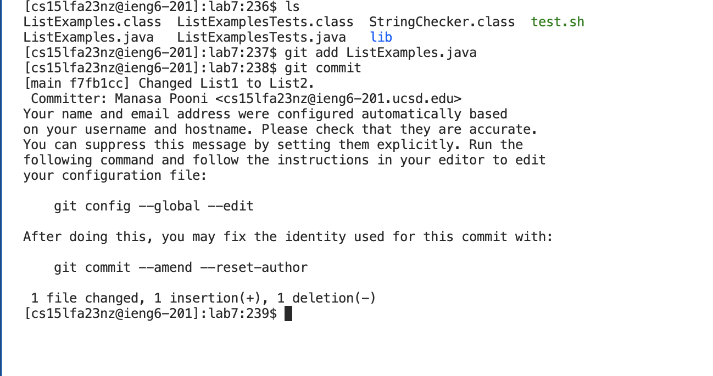

# Week 7 - Vim 

For this lab report we reproduce steps 4-9 shown below, take a screenshot, and write down exactly which keys were pressed to get to that step. 

Step 4. Log into ieng6

Step 5. Clone your fork of the repository from your Github account (using the SSH URL)

step 6.  Run the tests, demonstrating that they fail

step 7.  Edit the code file to fix the failing test

step 8. Run the tests, demonstrating that they now succeed

step 9.Commit and push the resulting change to your Github account (you can pick any commit message!)

# **4. Log into ieng6**


**Keys Pressed**: ```ssh cs15lfa23nz@ieng6.ucsd.edu``` was the command typed in at the command prompt followed by pressing the ```<enter>``` key to log into the ieng6 account/computer. 

# **5. Clone your fork of the repository from your Github account (using the SSH URL)**



**Keys Pressed**: To complete this step, what I did was type ```git clone git@github.com:mpooni23/lab7.git``` on the command prompt. Then I pressed the ```<enter>``` key to run the command. The resulting screenshot demonstrates the cloning of the forked repository.

# **6. Run the tests, demonstrating that they fail**


**Keys Pressed**: To complete this step, what I did was type ```ls``` followed by pressing the ```<enter>``` key on the command prompt to get the contents of the current directory. Then I typed ```cd lab7``` followed by ```<enter>``` to get into the lab7 directory. This was followed by typing ```ls``` and pressing the ```<enter>``` key to get the contents of the lab7 directory. Then I typed ```chmod u+x tests.sh``` followed by ```<enter>```to add the execute permissions for the current user on the test.sh shell script file. I then ran the test.sh file by typing ```./test.sh``` followed by the ```<enter>``` command. This resulted in a failure of one of the tests, as shown in the resulting screenshot.

# **7. Edit the code file to fix the failing test**




**Keys Pressed**: To complete this step, what I did was type ```vi  ListExamples.java``` on the command prompt followed by pressing the ```<enter>``` key. Then in the vi editor I pressed the ```k``` key 6 times, and press ```l``` key 11 times. Then I pressed the ```x``` key to delete the 1 in index1 and it was followed by followed by pressing the ```i``` key to insert a 2 to change index1 to index2. Next, you need to press ```<escape>``` key, followed by typing ```:wq```.

# **8 Run the tests, demonstrating that they now succeed**



 I then ran the test.sh file by typing ```./test.sh``` followed by the ```<enter>``` command. This resulted in all the tests succeeding, as shown in the resulting screenshot.

# **9 Commit and push the resulting change to your Github account (you can pick any commit message!)**






**Keys Pressed**: To complete this step, what I did was type ```git add ListExamples.java``` on the command prompt followed by pressing the ```<enter>``` key. This is followed by entering the command ```git commit``` followed by pressing the ```<enter>``` key. once the edito pops up I pressed the ```j``` key 14 times followed by an a, and then pressing enter. Then I typed ```Changed list1 to list2```.  Next, I pressed ```<escape>``` key, followed by typing ```:wq```. The results are shown in resulting screenshot.
