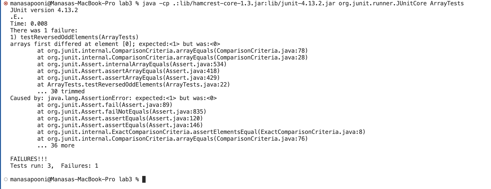

# Week 4 - Testing and Files

# PART 1

# **1. A failure-inducing input for the buggy program, as a JUnit test and any associated code (write it as a code block in Markdown)**

# **2. An input that doesn’t induce a failure, as a JUnit test and any associated code**

# **3. The symptom, as the output of running the tests (provide it as a screenshot of running JUnit with at least the two inputs above)**

# **4. The bug, as the before-and-after code change required to fix it (as two code blocks in Markdown)**

# PART 2

1. find . -name "Chapter*.*" -print

2. find . -type d -print

3. find . -type d -size +1k
   
4. find . -type f -name "chapter*.*" -print
   
5. find . -name "Chapter*.*" -exec wc -l {} \;
   
6. find . -name "*.*" -exec grep -nH "Tuesday, September 11, 2001" {} \;
    
7. find . -name "*.java" -exec grep -nH "Tuesday" {} \;
